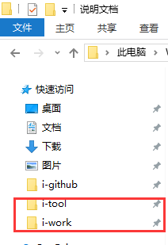

# 简易进销存开发说明

## 一、搭建环境

### 1、环境变量

1、项目路径统一命名

```
工具类 i-tool，开发使用的所有工具统一放在此处。
工作区 i-work，所有开发项目的根目录。
```

2、将以上两个文件夹拖动到文件管理器的`快速访问`，便于后续其他协助



3、参考下图进行参数配置


**3、安装路径请根据自身电脑进行配置，建议使用软件的默认安装配置**

新建 JAVA_HOME

```
JAVA_HOME
C:\Program Files\Java\jdk1.8.0_171
```

新建变量 CLASSPATH
```
CLASSPATH
.;%JAVA_HOME%\lib
```

新建变量 MAVEN_HOME
```
MAVEN_HOME
C:\Users\iCrazyMage\Documents\i-tool\apache-maven-3.3.9
```

修改系统变量 Path
```
Path
;%JAVA_HOME%\bin;%JAVA_HOME%\jre\bin;%MAVEN_HOME%\bin
```

4、检查环境配置是否成功

在控制台分别输入以下命令

```
javac -version

mvn -v
```

出现以下画面则说明环境变量配置成功


### 2、导入项目

2-1、点击`File`菜单，选择`Import`选项


2-2、选择 `Maven` 类型导入


2-3、导入 `i-work`目录下的 `summer-training`项目


2-4、等待大约3分钟，根据 `maven` 导入依赖包

### 3、添加tomcat

3-1、打开eclipse配置窗口


3-2、添加`i-tool`目录下的tomcat容器


### 4、运行项目

4-1、将 `summer-traning` 加入 `tomcat`容器


4-2、将 `server.xml`的端口为 `80`


4-3、移动到文件底部，将 `summer-training`放置到到根目录 `/`


4-4、启动项目


出现以下提示则说明项目运行成功了


打开浏览器输入 `127.0.0.1` 或者 `localhost`，出现以下画面则说明运行成功


### 5、连接Mysql

5-1、安装`i-tool`目录下的 `sqlyog_x64`软件

5-2、参考 `application.properties` 下的rds配置，添加到以下窗口


## 二、需求说明

### 1、系统首页

1、能看到每个菜单的连接

2、确保每个连接都是可用

### 2、商品资料

#### 2-1 样例数据

| 编号 | 品名 | 规格 | 单位 | 库存 |
| ---- | ---- | ---- | ---- | ---- |
| P001 | 电脑 | i5   | 台   | 4    |
| P002 | 电脑 | I7   | 台   | 5    |
| P003 | 手机 | 华为 | 部   | 6    |
| P004 | 手机 | 三星 | 部   | 7    |

#### 2-2 数据结构

表名  `s_partinfo`

| 字段    | 说明     | 备注                       |
| ------- | -------- | -------------------------- |
| corpNo_ | 所属帐套 | 手机号后4位                |
| code_   | 商品编号 |                            |
| desc_   | 商品名称 |                            |
| spec_   | 商品规格 |                            |
| unit_   | 商品单位 |                            |
| stock_  | 商品库存 | 通过单据回写，不能直接输入 |

### 3、单据管理

#### 3-1 样例数据

##### 3-1-1 单头数据

| 单据类别 | 单据编号    | 单据日期 | 建档人员 | 建档时间 |
| -------- | ----------- | -------- | -------- | -------- |
| AB       | AB180701001 | 2018-7-1 | 自己姓名 | 当前时间 |
| AB       | AB180701002 | 2018-7-1 | 自己姓名 | 当前时间 |
| BC       | BC180701001 | 2018-7-1 | 自己姓名 | 当前时间 |
| BC       | BC180701004 | 2018-7-1 | 自己姓名 | 当前时间 |
| AE       | AE180701001 | 2018-7-1 | 自己姓名 | 当前时间 |
| AE       | AE180701002 | 2018-7-1 | 自己姓名 | 当前时间 |

##### 3-1-2 单身数据

| 单据编号    | 单序 | 商品编号 | 名称 | 规格 | 单位 | 数量 |
| ----------- | ---- | -------- | ---- | ---- | ---- | ---- |
| AB180701001 | 1    | P001     | 电脑 | I5   | 台   | 2    |
| AB180701001 | 2    | P002     | 电脑 | I7   | 台   | 3    |
| AB180701001 | 3    | P003     | 手机 | 华为 | 部   | 1    |
| AB180701001 | 4    | P004     | 手机 | 三星 | 部   | 2    |

**注意：单身商品名称请关联商品基本表获取**

#### 3-2 数据结构

##### 3-2-1 单头结构

表名 `s_tranh`

| 字段        | 说明     | 备注         |
| ----------- | -------- | ------------ |
| corpNo_     | 帐套     | 手机号后四位 |
| tb_         | 单别     |              |
| tbNo_       | 单号     |              |
| tbDate_     | 单据日期 |              |
| createUser_ | 建档人员 |              |
| createDate_ | 建档日期 |              |

##### 3-2-2 单身结构

表名 `s_tranb`

| 字段      | 说明     | 备注                 |
| --------- | -------- | -------------------- |
| tbNo_     | 单号     | 与tranh表的tbNo_关联 |
| it_       | 单序     |                      |
| code_     | 商品编号 |                      |
| curstock_ | 当前库存 |                      |
| num_      | 商品数量 |                      |

### 4、统计报表

#### 5-1 样例数据

| 商品名称 | 入库数量 | 出库数量 | 盈亏数量 |
| -------- | -------- | -------- | -------- |
| iPhoneX  | 100      | 20       | 80       |
| 小米8    | 200      | 100      | 100      |

## 三、注意事项

1、商品信息、单据信息请根据帐套进行区分，即个人手机号后4位

2、进货管理和销售管理共用一张表结构，通过单别进行区分

3、每一张单据都是由单头关联单身进行组成，不允许出现单身无关联的单头信息

