# 简易进销存开发说明

## 一、搭建环境

### 1、获取工具

1. 从统一的U盘中获取指定的工具集合
2. 复制到个人电脑目录下，方便管理和查找即可，建议放在磁盘根目录下
3. 然后将拷贝好的文件夹统一拖动到`快速访问`，这样在同事之间相互协助的时候就可以快速定位到文件了


4. 目录说明

```
i-tool，所有工具的总目录。
i-work，所有项目的总目录。
```

### 2、安装软件

1. 将 `i-tool`目录下`.exe`全部安装，建议使用软件默认的安装路径
2. 将`.zip`结尾的软件包全部解压到当前的目录下

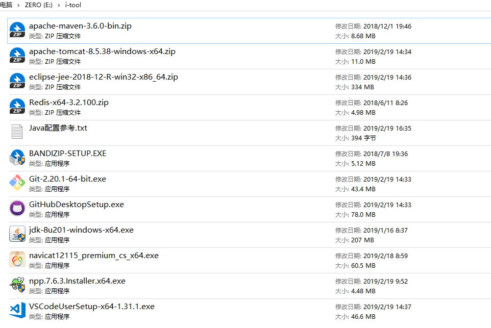

### 3、环境变量

1. 打开我的电脑 –> 属性

    

2. 参考下图打开系统环境变量设置


3、参考以下变量进行配置

**注意**：由于每个人的电脑的用户名是不一样的，切不可直接复制下述的实际路径，C盘的实际路径请根据个人的电脑文件配置进行配置。

3-1、新建Java变量 `JAVA_HOME`

```
JAVA_HOME
# 请参考你的电脑实际路径
C:\Program Files\Java\jdk1.8.0_201
```

3-2、 新建路径变量 `CLASSPATH`

```
CLASSPATH
.;%JAVA_HOME%\lib
```

3-3、 新建Maven变量 `MAVEN_HOME`

```
MAVEN_HOME
# 请参考你的电脑实际路径
C:\Users\l1091\Documents\i-tool\apache-maven-3.6.0
```

3-4、 修改系统变量 `Path`

**注意**：在原有变量后面追加，不要覆盖其他变量路径

```
Path
;%JAVA_HOME%\bin;%JAVA_HOME%\jre\bin;%MAVEN_HOME%\bin
```

`Windows10`操作系统请点击编辑文本

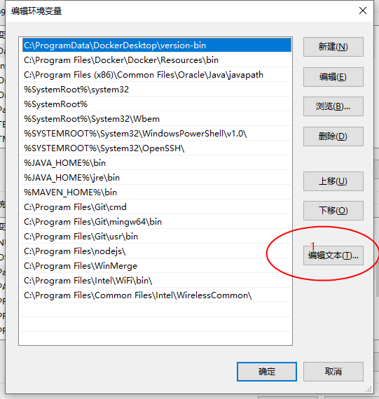

移动到`变量值`的行末进行复制

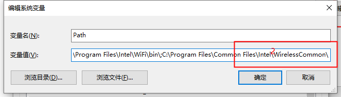

4、打开系统控制台检查环境配置是否成功

检查`java`是否安装成功

```
javac -version
```

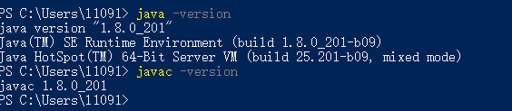****

检查`maven`是否安装成功

```
mvn -v
```


如果出现了正确的版本号则说明安装成功了，否则请重新安装。

### 2、导入项目

2-1、点击`File`菜单，选择`Import`选项


2-2、选择 `Maven` 类型导入


2-3、导入 `i-work`目录下的 `summer-training`项目


2-4、等待大约3分钟，根据 `maven` 导入依赖包

### 3、添加tomcat

3-1、打开eclipse配置窗口


3-2、添加`i-tool`目录下的tomcat容器

请根据`i-tool`目录下的`tomcat`选择引入合适的版本，若版本号不一致，则无法导入。


### 4、运行项目

4-1、将 `summer-traning` 加入 `tomcat`容器

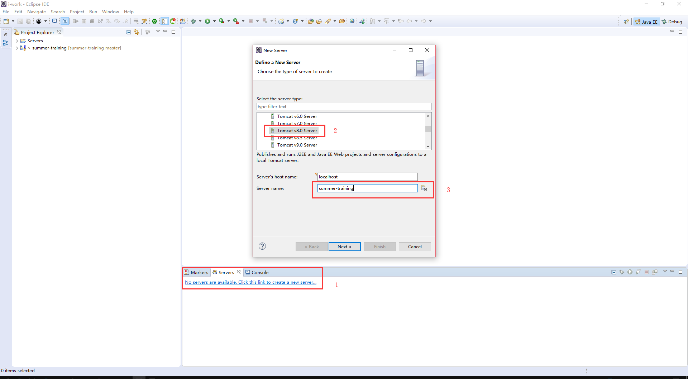

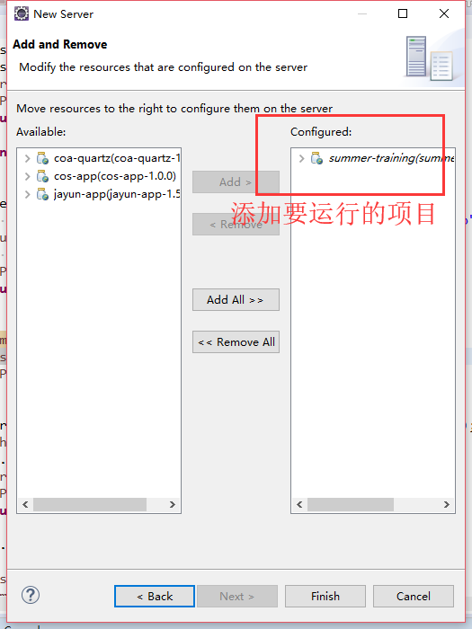

4-2、将 `server.xml`的端口为 `80`

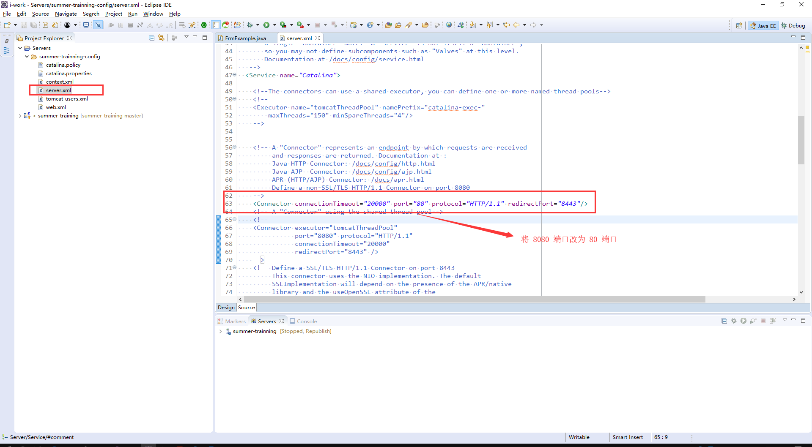

4-3、移动到文件底部，将 `summer-training`放置到到根目录 `/`


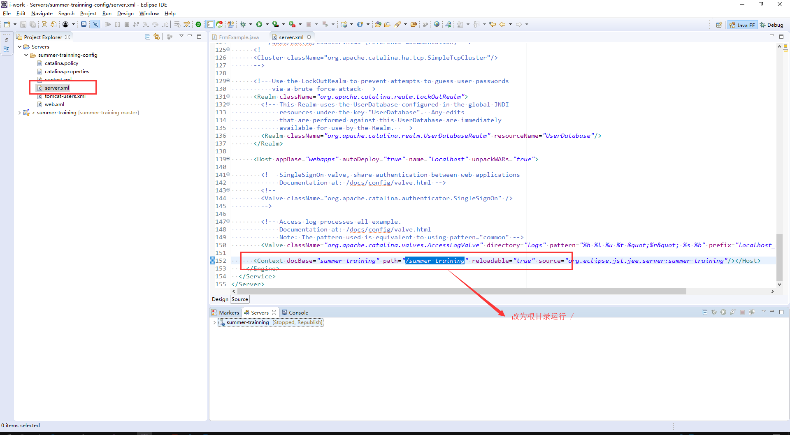

4-4、启动项目

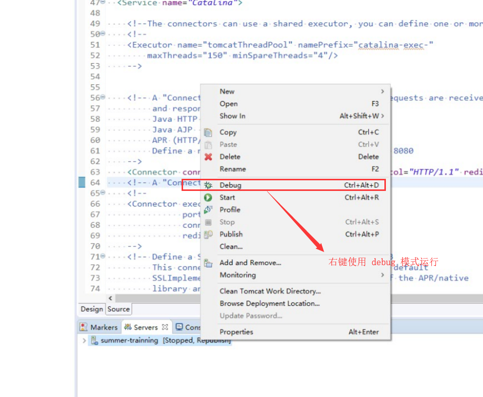

出现以下提示则说明项目运行成功了


打开浏览器输入 `127.0.0.1`，出现以下画面则说明运行成功

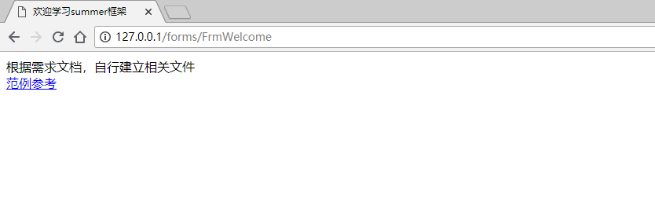

### 5、连接Mysql

5-1、安装`i-tool`目录下的 `sqlyog_x64`软件

5-2、参考 `application.properties` 下的rds配置，添加到以下窗口

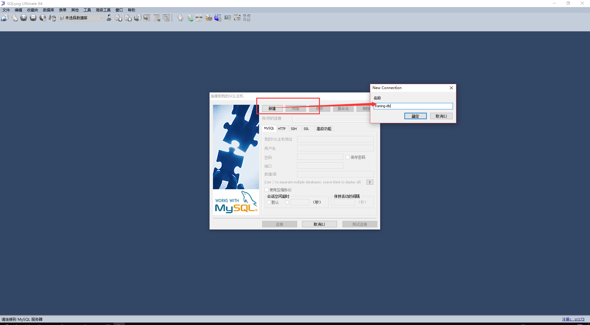

## 二、需求说明

### 1、系统首页

1、能看到每个菜单的连接

2、确保每个连接都是可用

### 2、商品资料

#### 2-1 样例数据

| 编号 | 品名 | 规格              | 单位 | 库存 |
| ---- | ---- | ----------------- | ---- | ---- |
| P001 | 电脑 | 电脑，15.6寸-黑色 | 台   | 4    |
| P002 | 电脑 | 电脑，13.3寸-白色 | 台   | 5    |
| P003 | 手机 | 小米MIX，5.9寸    | 台   | 6    |
| P004 | 手机 | iPhoneX，5.5寸    | 台   | 7    |

#### 2-2 数据结构

表名  `s_partinfo`

| 字段    | 说明     | 备注                       |
| ------- | -------- | -------------------------- |
| corpNo_ | 所属帐套 | 手机号后4位                |
| code_   | 商品编号 |                            |
| desc_   | 商品名称 |                            |
| spec_   | 商品规格 |                            |
| unit_   | 商品单位 |                            |
| stock_  | 商品库存 | 通过单据回写，不能直接输入 |

说明

1、商品编号要确保唯一性

2、每个帐套商品是唯一的

3、不要查询出其他帐套的数据

4、商品资料建立不能直接设置库存，库存需要通过单据进行修改

### 3、单据管理

#### 3-1 样例数据

##### 3-1-1 单头数据

**注意：帐套代码建议是个人的手机号后4位**

| 帐套代码 | 单据类别 | 单据编号    | 单据日期   | 建档人员 | 建档时间 |
| -------- | :------: | ----------- | ---------- | -------- | -------- |
| 2747     |    AB    | AB180701001 | 2018-07-01 | 自己姓名 | 当前时间 |
| 2747     |    AB    | AB180701002 | 2018-07-01 | 自己姓名 | 当前时间 |
| 2747     |    BC    | BC180701001 | 2018-07-01 | 自己姓名 | 当前时间 |
| 2747     |    BC    | BC180701004 | 2018-07-01 | 自己姓名 | 当前时间 |
| 2747     |    AE    | AE180701001 | 2018-07-01 | 自己姓名 | 当前时间 |
| 2747     |    AE    | AE180701002 | 2018-07-01 | 自己姓名 | 当前时间 |

##### 3-1-2 进货/销售单身数据

| 帐套代码 | 单据编号    | 单序 | 商品名称          | 单位 | 数量 |
| -------- | ----------- | :--: | ----------------- | ---- | ---- |
| 2747     | AB180701001 |  1   | 电脑，15.6寸-黑色 | 台   | 2    |
| 2747     | AB180701001 |  2   | 电脑，13.3寸-白色 | 台   | 3    |
| 2747     | AB180701001 |  3   | 小米MIX，5.9寸    | 台   | 1    |
| 2747     | AB180701001 |  4   | iPhoneX，5.5寸    | 台   | 2    |

##### 3-1-3 盘点单身数据

| 帐套代码 | 单据编号    | 单序 | 名称           | 单位 | 当前库存 | 实际库存 | 盈亏数量 |
| -------- | ----------- | :--: | -------------- | ---- | -------- | -------- | -------- |
| 2747     | AE180701001 |  1   | 小米MIX，5.9寸 | 台   | 10       | 15       | 15       |
| 2747     | AE180701001 |  2   | iPhoneX，5.5寸 | 台   | 12       | 8        | -4       |

**说明**

1、单身商品名称请关联商品基本表获取

2、盈亏数量 = 实际库存 - 当前库存

3、单据编号和单序尽量能自动生成

#### 3-2 数据结构

##### 3-2-1 单头结构

表名 `s_tranh`

| 字段        | 说明     | 备注             |
| ----------- | -------- | ---------------- |
| corpNo_     | 帐套     | **手机号后四位** |
| tb_         | 单别     |                  |
| tbNo_       | 单号     |                  |
| tbDate_     | 单据日期 |                  |
| createUser_ | 建档人员 |                  |
| createDate_ | 建档日期 |                  |

##### 3-2-2 单身结构

表名 `s_tranb`

| 字段      | 说明     | 备注                                     |
| --------- | -------- | ---------------------------------------- |
| corpNo_   | 帐套     | **手机号后四位**                         |
| tbNo_     | 单号     | 与s_tranh表的tbNo_关联                   |
| it_       | 单序     |                                          |
| code_     | 商品编号 | 关联商品基本表 s_partinfo                |
| curstock_ | 当前库存 | 仅用于盘点单，进货单和销售单用不到该栏位 |
| newstock_ | 实际库存 | 仅用于盘点单，进货单和销售单用不到该栏位 |
| num_      | 商品数量 |                                          |

### 4、统计报表

#### 5-1 数据汇总

| 商品名称       | 入库数量 | 出库数量 | 盈亏数量 |
| -------------- | -------- | -------- | -------- |
| 小米MIX，5.9寸 | 200      | 100      | 100      |
| iPhoneX，5.5寸 | 100      | 20       | 80       |

#### 5-2 报表明细

| 商品名称       | 单据日期   | 单据编号    | 数量 | 单位 |
| -------------- | ---------- | ----------- | ---- | ---- |
| 小米MIX，5.9寸 | 2018-07-01 | AB180701001 | 100  | 台   |
| 小米MIX，5.9寸 | 2018-07-01 | AB180701002 | 100  | 台   |

数量合计 200

**说明**

1、点击汇总表的数据能跳转到明细表查看明细数据

2、明细表的数据等于汇总表的数据才能说明数据准确

3、统计报表需要包含汇总数据和明细数据两个页面

4、要能通过明细数据计算并且得到汇总页面的数据

5、能够查询指定日期和指定单据的数据明细

## 三、注意事项

1、商品信息、单据信息请根据帐套进行区分，即个人手机号后4位

2、增删改查不允许改动其他帐套的数据，即不可以改动他人的数据

3、进货管理和销售管理共用一张表结构，通过单别进行区分

4、每一张单据都是由单头关联单身进行组成，不允许出现单身无关联的单头信息

5、点击商品能够跳转到商品详细页面，查看商品数据
